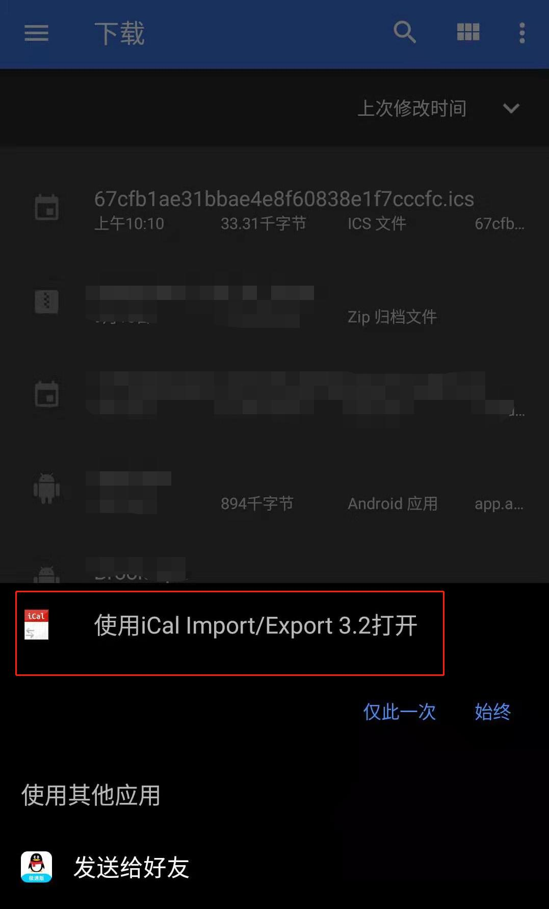
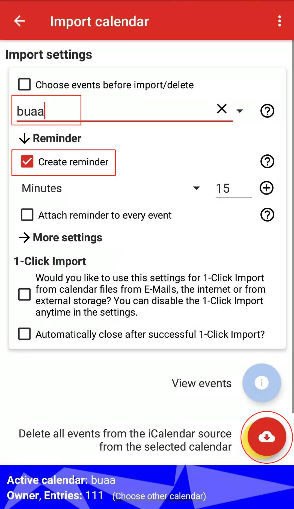
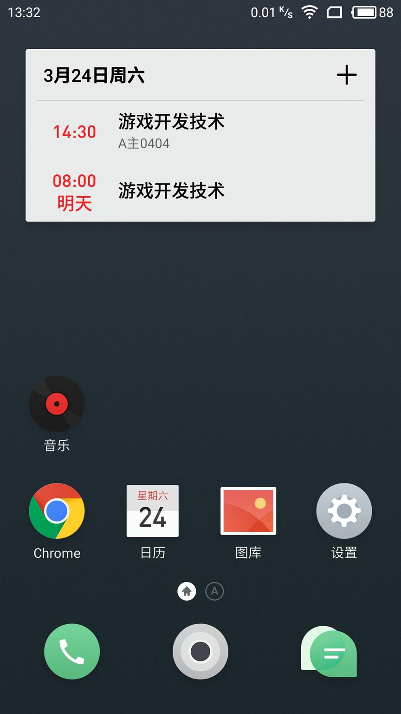

# 在安卓平台上将课表写入日历
> 如果您通过微信浏览本页面，请先选择”在浏览器中打开“
1. [点此](http://static.wecqu.com/iCal%20Import%20Export%20CalDAV_v3.2v188.apk) 下载iCal Import Export应用(大小3.7MB)
2. [点此](http://static.wecqu.com/your key.ics?_t=RANDOM) 或复制下载链接 `http://static.wecqu.com/your key.ics?_t=RANDOM` 到浏览器，下载课表文件
3. 打开下载好的课表文件，选择”使用iCal Import Export“打开

4. 选择一个日历账户进行课表导入，你也可以创建新日历账户
5. 在”Calendar tag“输入框里填入`buaa`；展开Reminder选项，勾选”Create reminder“即可设置上课提醒（默认提前15分钟提醒，可自定义提醒时间）

6. 点击右下角红色按钮完成导入，导入成功后即可删除该应用
7. 将日历小部件添加到桌面可以更方便地查看课表

## 其他
 - iCal Import Export应用的Google商店链接为`https://play.google.com/store/apps/details?id=tk.drlue.icalimportexport`
 - 课表发生更新时，需要重新导入，只需重新执行此教程即可自动删除之前课表事件，添加新课表