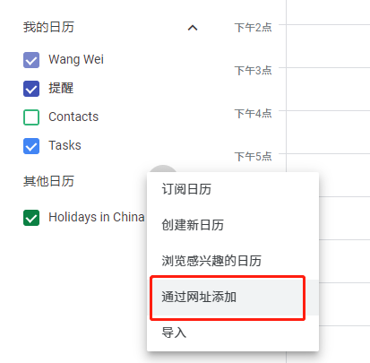
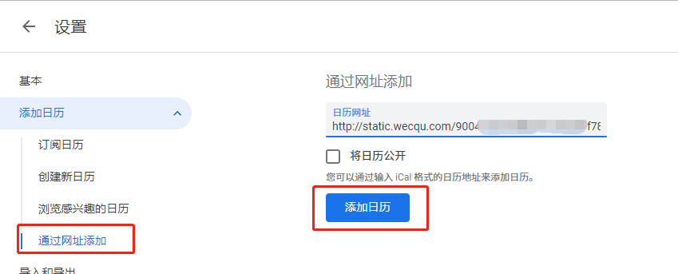
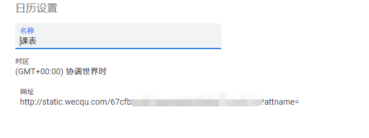

#  将课表导入谷歌日历

1. 在浏览器打开 `https://calendar.google.com/calendar/` 
2. 在左侧的"其他日历"旁的”+“号中选择”通过网址添加“

3. 在日历网址栏输入`http://static.wecqu.com/your key.ics?_t=RANDOM`，并选择”添加日历“

4. 返回主界面就可以看到课表了。
5. 可以对课表账户进行重命名，来使用自定义日历名称。

