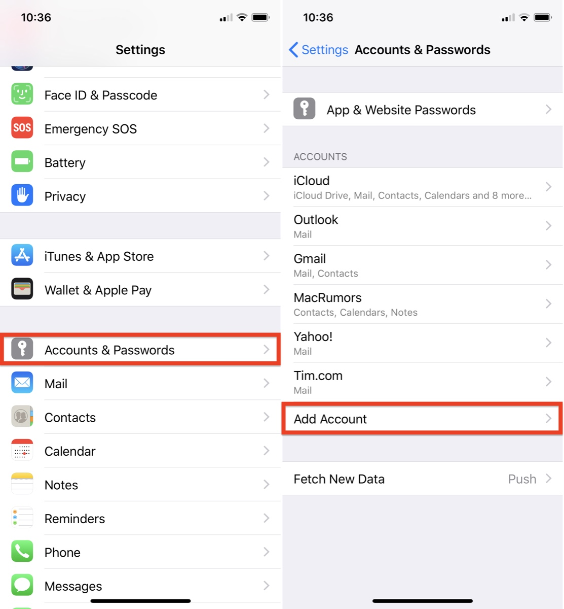
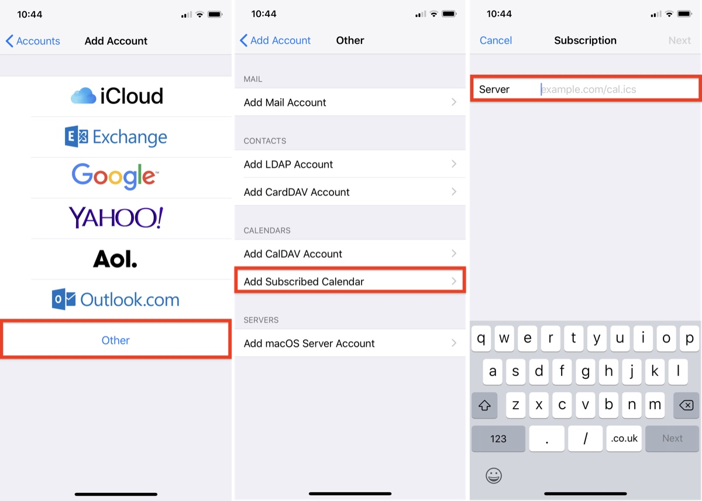

# 在IOS平台上将课表写入日历
1. 启动iPhone或iPad上的”设置“应用，选择”密码与账户“设置项，点击底部的”添加账户“。

2. 选择底部”其他“，在新页面选择”添加已定阅的日历“，在输入框中输入`http://static.wecqu.com/your key.ics`

3. 选择下一步，在”描述“栏输入自定义课表名称，其他选项不做更改，点击保存。
4. 打开系统日历，就可以看到课表了。
5. 可以将日程小部件加入通知栏上，更方便地查看课程。

## 其他
课表发生更新时，需要先删除订阅的日历账户然后重新导入。删除日历账户的方法如下：
1. 启动iPhone或iPad上的”设置“应用，选择”密码与账户“设置项，点击”已订阅的日历“。
2. 选择课表日历相，点击底部“删除账户”

