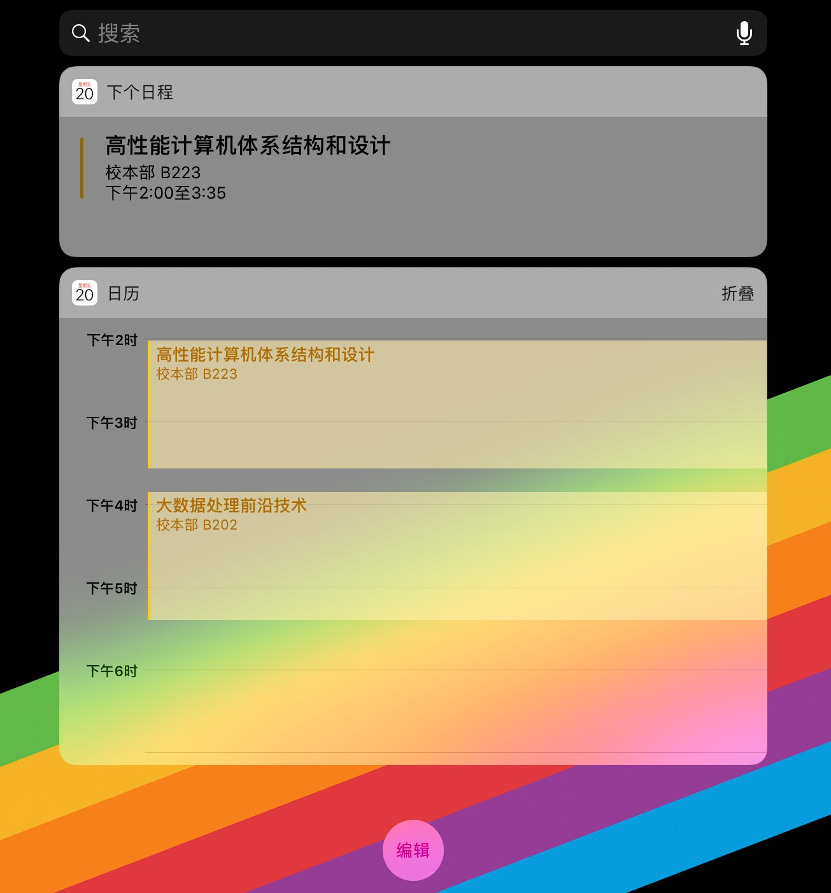
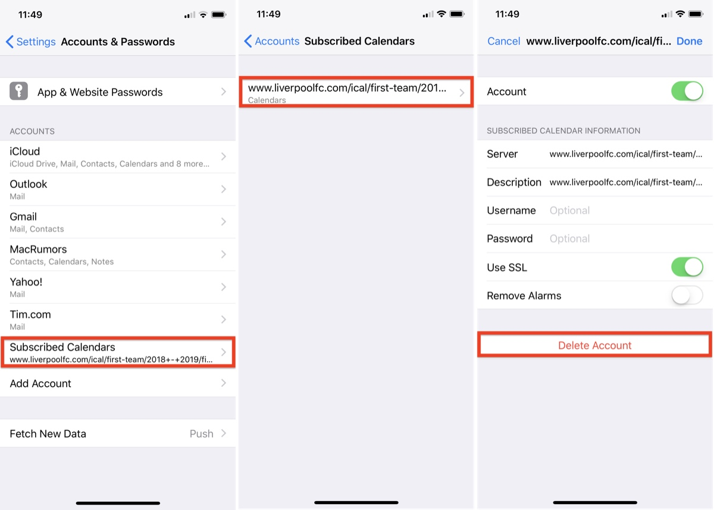

# 在IOS平台上将课表写入日历
> 如果您通过微信浏览本页面，请先选择”在浏览器中打开“

1. [点此](webcal://static.wecqu.com/your key_apple.ics?_t=RANDOM) 或将`webcal://static.wecqu.com/your key_apple.ics?_t=RANDOM`复制到Safari浏览器订阅课表
2. 打开系统日历，就可以看到课表了。
3. 可以将日程小部件加入通知栏上，更方便地查看课程。

## 其他
课表发生更新时，需要先删除订阅的日历账户然后重新导入。删除日历账户的方法如下：
1. 启动iPhone或iPad上的”设置“应用，选择”密码与账户“设置项，点击”已订阅的日历“。
2. 选择课表日历相，点击底部“删除账户”

