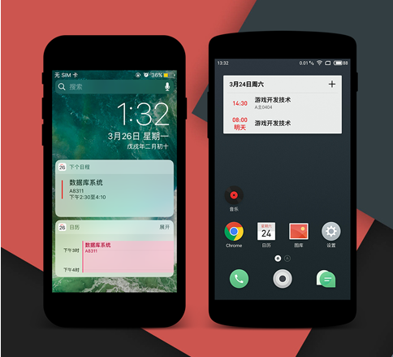
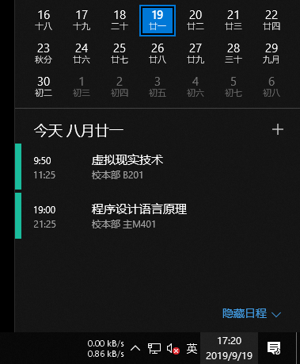
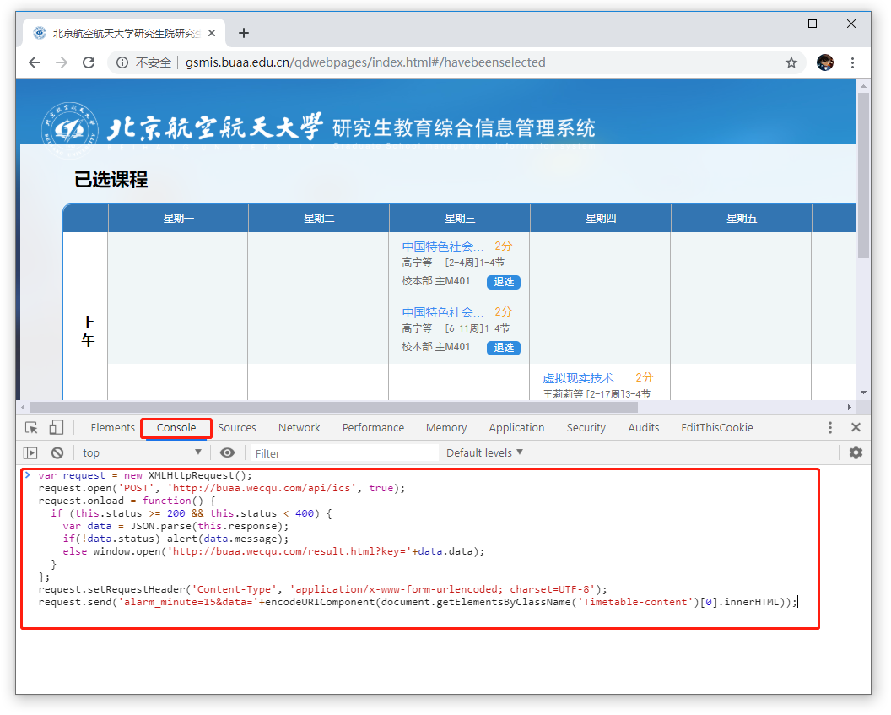

# BUAA课表写入日历教程
本教程可将您的课表导入到系统日历中，可以方便地查看课表，无需安装任何软件（安卓平台可能需要一个导入工具），并支持上课提醒(win10平台暂不支持提醒功能)。

### 移动端效果图

### PC效果图


## 使用方法
电脑端使用Chrome打开课表页面(调选课 -> 已选课程)，然后在课表页面下按F12打开Chrome调试面板，在`console`栏中粘贴以下代码，并按下回车执行。之后根据页面提示进行操作。
```js
var request = new XMLHttpRequest();
request.open('POST', 'http://buaa.wecqu.com/api/ics', true);
request.onload = function() {
  if (this.status >= 200 && this.status < 400) {
    var data = JSON.parse(this.response);
    if(!data.status) alert(data.message);
    else window.open('http://buaa.wecqu.com/result.html?key='+data.data);
  }
};
request.setRequestHeader('Content-Type', 'application/x-www-form-urlencoded; charset=UTF-8');
request.send('alarm_minute=15&data='+encodeURIComponent(document.getElementsByClassName('Timetable-content')[0].innerHTML)+'&f='+window.location.hash.substr(2,10));
   
   
```
> 默认提前15分钟进行课程提醒，若要更改，请更改上方代码最后一行的`alarm_minute=15`部分，将15改成想要的时间再回车执行代码，仅支持IOS平台设置。


## 关于本项目
### 反馈
邮件 `wang0.618&qq.com` (将&替换成@)
### 隐私相关
本项目需要将您的课表数据保存至服务器端，但课表数据中不包含您的身份信息，不会造成隐私泄露。
### 项目代码
项目已在github开源: [https://github.com/wang0618/buaa_schedule](https://github.com/wang0618/buaa_schedule)