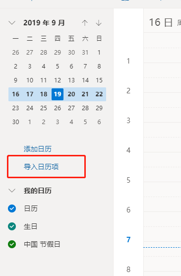
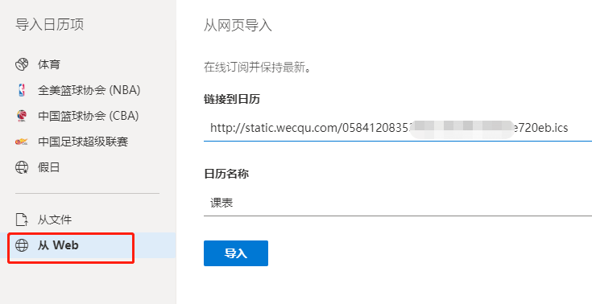

# 在Win10日历中查看课表
1. 在浏览器打开 `https://outlook.live.com/calendar/view/week` ，登录微软账号
2. 选择左侧的"导入日历项"

3. 在弹出的窗口中选择”从Web“ ，链接到日历栏输入`http://static.wecqu.com/your key.ics?_t=RANDOM`，日历名称自定，填写完毕后点击”导入“。

4. 此时在网页端的outlook日历中已经可以查看课表了，将课表显示到win10的任务栏的日历中，只需要打开win10的日历应用，然后登陆微软账号便可同步(之前已登录的需要选择右上方“···”下的“同步”)。
5. 任务栏的日历里就可以显示课表了

6. 锁屏界面也可以查看课表哦

